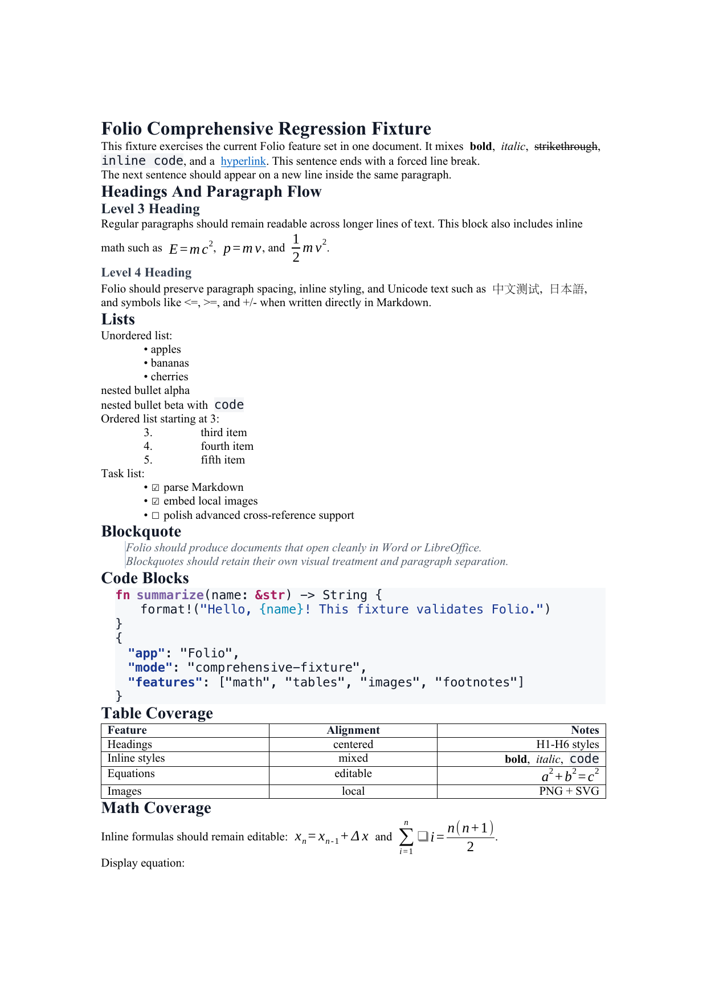
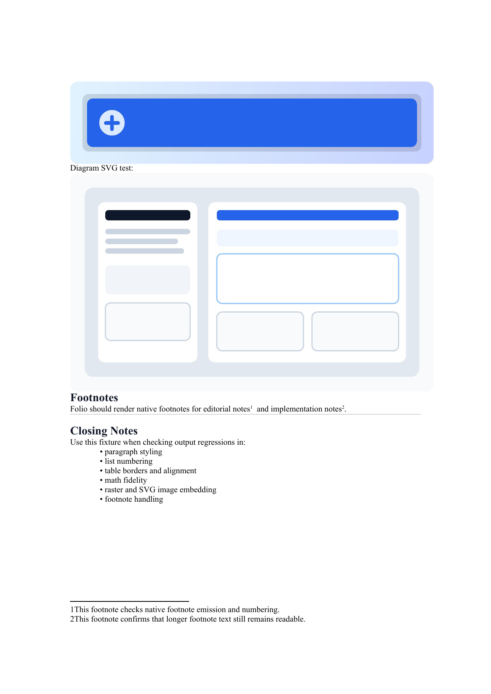
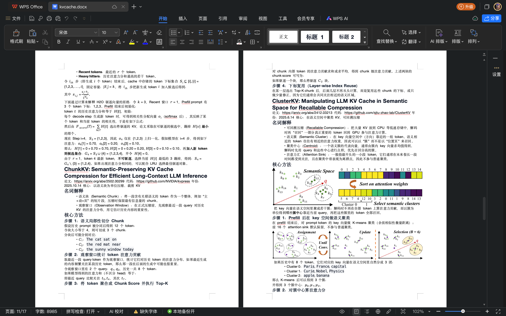
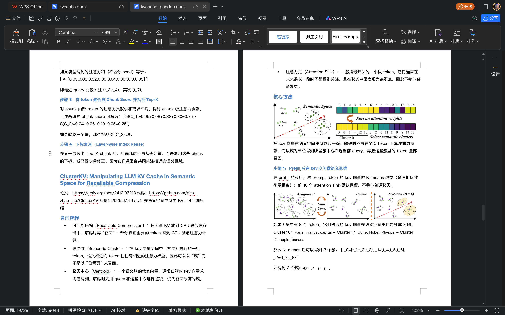

<p align="center">
  
</p>

<h1 align="center">Folio</h1>

<p align="center">
  面向高质量 <code>.docx</code> 输出的 Markdown 转 Word 工具，尽量不再需要后期手工修格式。
</p>

<p align="center">
  <a href="README.md"><strong>English</strong></a>
  ·
  <a href="README-CN.md">简体中文</a>
</p>

Folio 是一个跨平台桌面应用和 Rust 工作区，用于把 Markdown 转成结构正确、可继续编辑的 Microsoft Word 文档，而不是“能打开但还得再修一遍”的导出结果。它重点解决公式、图片、表格、层级样式等常见问题，让导出的文档在 Word 或 LibreOffice 中看起来更像最终成品。

## 快速开始

### 对大多数用户

Win 和 mac 上最简单的用法，都是直接从 [GitHub Releases](https://github.com/Livia-Tassel/Folio/releases) 下载已经打好的安装包，而不是自己配置 Rust / Node 环境。

- macOS：下载对应 CPU 架构的 `.dmg`
- Apple Silicon：选 `aarch64` / `arm64`
- Intel Mac：选 `x64`
- 打开 `.dmg` 后，把 **Folio** 拖到 **Applications**
- Windows：优先下载 NSIS 的 `.exe` 安装包，最省事

由于 Folio 目前还是 pre-alpha，且很可能尚未完成代码签名，首次启动时系统可能会提示风险：

- macOS：如果 Gatekeeper 阻止打开，请在 Applications 里右键 **Folio**，选择 **Open**
- Windows：如果出现 SmartScreen，点击 **More info** -> **Run anyway**

### 如果你是开发者

下面的“开发”部分适合想从源码运行、调试或参与贡献的人。

## 为什么做 Folio

很多 Markdown 转 DOCX 的流程最后都会卡在“最后 10%”：

- 数学公式被拍平成图片，或者生成错误的 XML
- 列表和表格还要手工修
- 图片尺寸不可控，容易溢出或缩放异常
- 报告、论文、正式文档的版式仍然要回到 Word 里慢慢调

Folio 的目标就是把这些问题尽量前移到转换流程里解决。

## 示例导出

下面这组三联示例来自综合回归样例 [`test/folio-comprehensive.md`](test/folio-comprehensive.md)，导出文件为 [`test/output/folio-comprehensive.docx`](test/output/folio-comprehensive.docx)，截图来自对应 PDF 的渲染结果。

<table>
  <tr>
    <td width="33.33%" valign="top">
      
    </td>
    <td width="33.33%" valign="top">
      
    </td>
    <td width="33.33%" valign="top">
      
    </td>
  </tr>
  <tr>
    <td align="center"><strong>第 1 页</strong><br/>格式、列表、代码块与表格</td>
    <td align="center"><strong>第 2 页</strong><br/>公式与位图 Logo 嵌入</td>
    <td align="center"><strong>第 3 页</strong><br/>SVG 资源与脚注</td>
  </tr>
</table>

<p align="center">
  <a href="test/output/folio-comprehensive.docx">下载 DOCX</a>
  ·
  <a href="test/output/folio-comprehensive.pdf">查看 PDF</a>
  ·
  <a href="test/folio-comprehensive.md">查看 Markdown 源文件</a>
</p>

当前示例覆盖了：

- 标题层级
- 行内强调、代码和链接
- 无序列表、有序列表、任务列表
- 引用块与代码块
- 对齐表格
- 行内与块级 LaTeX 公式（导出为可编辑 OMML）
- 位图与 SVG 图片嵌入
- 脚注

## 用 WPS 对比 Pandoc

下面这组对比，使用的是同一份技术笔记先导出为 `.docx`，再统一用 **WPS Office** 打开做实际观感检查。

<table>
  <tr>
    <td width="33.33%" valign="top">
      
    </td>
    <td width="33.33%" valign="top">
      
    </td>
    </td>
  </tr>
  <tr>
    <td align="center"><strong>Folio</strong></td>
    <td align="center"><strong>Pandoc</strong></td>
  </tr>
</table>

在这份笔记里，Folio 相比 Pandoc 的优势主要集中在技术文档最关键的几个点：

- 公式密集段落更接近原本的阅读顺序，不容易塌成行内碎片
- 图片、标题、正文混排时更稳，跨页后的结构更完整
- 长笔记整体更紧凑，不容易像 Pandoc 那样明显增页、变松

## 当前能力

Folio 目前仍处于 **pre-alpha**，但核心转换链路已经不是原型脚本，而是一个相对完整的多 crate Rust 工程。

已实现：

- CommonMark / GFM Markdown 解析
- 供后续转换使用的 typed AST
- LaTeX -> MathML -> OMML 转换
- 图片加载、归一化和 SVG 光栅化
- 带样式、编号、脚注、表格、图片的 DOCX 输出
- 桌面端 HTML 预览
- 基于 Tauri + Svelte 的桌面壳层

尚未完整实现：

- 从用户 `reference.docx` 中读取模板样式
- 更丰富的论文/文档预设
- 图表公式交叉引用与自动编号
- 批量转换相关 UX 打磨
- 更高一致性的预览效果

## 技术栈

### 核心转换引擎

- Rust stable workspace
- `pulldown-cmark`：Markdown 解析
- `latex2mathml` + 自定义 `MathML -> OMML` 转换器
- `docx-rs`：OpenXML / DOCX 生成
- `image` + `resvg`：位图与 SVG 资源处理
- `syntect`：代码高亮
- `zip` + `quick-xml`：DOCX 包后处理

### 桌面应用

- Tauri 2：原生桌面壳
- Svelte 5 + SvelteKit：前端界面
- Vite：前端构建工具
- Tailwind CSS 4：样式层
- TypeScript：前端代码

## 仓库结构

产品名称已经切换为 **Folio**。为了避免一次性的大规模包重命名，当前内部 crate 仍然保留历史 `scribe-*` 前缀。

```text
crates/
  scribe-ast        Markdown typed AST
  scribe-parser     Markdown -> AST
  scribe-math       LaTeX -> MathML -> OMML
  scribe-images     图片加载与尺寸处理
  scribe-highlight  代码高亮
  scribe-template   模板与样式管线
  scribe-docx       AST -> .docx 输出
  scribe-preview    AST -> HTML 预览
  scribe-core       公共编排层
  scribe-tauri      桌面应用壳层
scribe-cli/         CLI 转换入口
fixtures/           小型功能样例
test/               综合回归样例与导出产物
docs/               设计文档与 README 资源
```

## 开发

### 环境要求

- Rust stable
- Node.js 20+
- `pnpm`

### 安装前端依赖

```bash
pnpm --dir crates/scribe-tauri/frontend install
```

### 运行测试

```bash
cargo test --workspace
pnpm --dir crates/scribe-tauri/frontend check
```

### 启动桌面应用

```bash
cd crates/scribe-tauri
cargo tauri dev
```

## 发布给普通用户

如果你想让别人拿到仓库后尽量“开箱即用”，默认分发方式应该是 GitHub Releases。

1. 在 [`Cargo.toml`](Cargo.toml) 里更新版本号
2. 创建并推送形如 `v0.1.2` 的 tag
3. GitHub Actions 会自动构建并发布这些安装包：
   - macOS Apple Silicon `.dmg`
   - macOS Intel `.dmg`
   - Windows NSIS `.exe`

release workflow 会在打包前，基于 [`crates/scribe-tauri/icons/icon.png`](crates/scribe-tauri/icons/icon.png) 自动生成各平台需要的图标资源。

## 样例与回归测试

仓库中既有 [`fixtures/`](fixtures/) 下的聚焦样例，也有 [`test/`](test/) 下的一体化综合回归样例。

常用命令：

```bash
cargo run -p scribe-cli -- fixtures/english/m2-kitchen-sink.md -o /tmp/folio-m2.docx
cargo run -p scribe-cli -- fixtures/english/m3-math.md -o /tmp/folio-m3.docx
cargo run -p scribe-cli -- test/folio-comprehensive.md -o test/output/folio-comprehensive.docx
soffice --headless --convert-to pdf --outdir test/output test/output/folio-comprehensive.docx
```

## 设计文档

- [`docs/superpowers/specs/2026-04-17-scribe-md-to-docx-design.md`](docs/superpowers/specs/2026-04-17-scribe-md-to-docx-design.md)
- [`docs/superpowers/plans/2026-04-17-scribe-v1-plan.md`](docs/superpowers/plans/2026-04-17-scribe-v1-plan.md)

## GitHub 活动

<p align="center">
  <a href="https://github.com/Livia-Tassel/Folio/stargazers">
    
  </a>
  <a href="https://github.com/Livia-Tassel/Folio/network/members">
    
  </a>
  <a href="https://github.com/Livia-Tassel/Folio/issues">
    
  </a>
</p>

<p align="center">
  <a href="https://github.com/Livia-Tassel/Folio">
    
  </a>
</p>

## License

MIT，详见 [`LICENSE`](LICENSE)。
