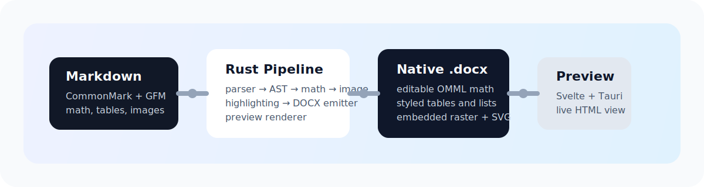

<p align="center">
  
</p>

<h1 align="center">Folio</h1>

<p align="center">
  Markdown to polished <code>.docx</code> output, without the cleanup pass.
</p>

<p align="center">
  <a href="README.md"><strong>English</strong></a>
  ·
  <a href="README-CN.md">简体中文</a>
</p>

<p align="center">
  <a href="https://github.com/Livia-Tassel/Folio/stargazers">
    
  </a>
  <a href="https://github.com/Livia-Tassel/Folio/network/members">
    
  </a>
  <a href="https://github.com/Livia-Tassel/Folio/issues">
    
  </a>
  <a href="https://github.com/Livia-Tassel/Folio/commits/master">
    
  </a>
  <a href="LICENSE">
    
  </a>
</p>

<p align="center">
  
</p>

Folio is a cross-platform desktop application and Rust workspace for turning Markdown into Microsoft Word documents with native Word structures instead of brittle export artifacts. The focus is practical fidelity: editable equations, sane image sizing, readable tables, predictable heading hierarchy, and output that looks intentional when it opens in Word or LibreOffice.

## Why Folio

Most Markdown-to-DOCX workflows break down in the last 10%:

- math is flattened into images or mangled XML
- lists and tables need manual repair
- images overflow, shrink unpredictably, or lose aspect ratio
- report and academic formatting still needs hand cleanup in Word

Folio is built to close that gap with a pure Rust pipeline and a desktop UX around it.

## Sample Export

The samples below are generated from the comprehensive regression fixture in [`test/folio-comprehensive.md`](test/folio-comprehensive.md), exported to [`test/output/folio-comprehensive.docx`](test/output/folio-comprehensive.docx), and rendered from the corresponding PDF.

<table>
  <tr>
    <td width="33.33%" valign="top">
      
    </td>
    <td width="33.33%" valign="top">
      
    </td>
    <td width="33.33%" valign="top">
      
    </td>
  </tr>
  <tr>
    <td align="center"><strong>Page 1</strong><br/>Formatting, lists, code, and tables</td>
    <td align="center"><strong>Page 2</strong><br/>Math and raster logo embedding</td>
    <td align="center"><strong>Page 3</strong><br/>SVG assets and footnotes</td>
  </tr>
</table>

<p align="center">
  <a href="test/output/folio-comprehensive.docx">Download DOCX</a>
  ·
  <a href="test/output/folio-comprehensive.pdf">Open PDF</a>
  ·
  <a href="test/folio-comprehensive.md">View Source Markdown</a>
</p>

The current sample exercises:

- heading hierarchy
- inline emphasis, code, and links
- unordered, ordered, and task lists
- blockquotes and code blocks
- aligned tables
- inline and display LaTeX math rendered as editable OMML
- raster and SVG image embedding
- footnotes

## What Works Today

Folio is still **pre-alpha**, but the core conversion path is already structured as a serious multi-crate system rather than a prototype script.

Implemented today:

- Markdown parsing with CommonMark and GFM features
- typed AST for downstream transforms
- LaTeX -> MathML -> OMML conversion
- image loading, normalization, and SVG rasterization
- DOCX emission with styles, numbering, footnotes, tables, and images
- HTML preview rendering for the desktop app
- Tauri desktop shell with a Svelte frontend

Not complete yet:

- reference-template ingestion from user `reference.docx`
- richer academic presets and style packs
- cross-references and auto-numbered figures, tables, and equations
- batch conversion UX polish
- higher-fidelity preview parity

## Technology Stack

### Core conversion engine

- Rust stable workspace
- `pulldown-cmark` for Markdown parsing
- `latex2mathml` plus a custom `MathML -> OMML` transformer
- `docx-rs` for OpenXML document generation
- `image` and `resvg` for raster and SVG asset handling
- `syntect` for syntax highlighting
- `zip` and `quick-xml` for DOCX package post-processing

### Desktop app

- Tauri 2 for the native desktop shell
- Svelte 5 + SvelteKit for the frontend
- Vite for frontend build tooling
- Tailwind CSS 4 for styling
- TypeScript for the UI layer

### Output model

- native Word paragraphs, runs, numbering, and footnotes
- editable OMML equations instead of screenshots
- embedded raster media for portable image rendering
- HTML preview generated from the same AST used for DOCX emission

## Repository Layout

The product is branded as **Folio**. Internal crate and package names still use the historical `scribe-*` prefix for now so the workspace can evolve without a broad package rename.

```text
crates/
  scribe-ast        Typed Markdown AST
  scribe-parser     Markdown -> AST
  scribe-math       LaTeX -> MathML -> OMML
  scribe-images     Image loading and sizing
  scribe-highlight  Code highlighting
  scribe-template   Template/style plumbing
  scribe-docx       AST -> .docx emission
  scribe-preview    AST -> HTML preview
  scribe-core       Shared orchestration API
  scribe-tauri      Desktop shell and frontend bridge
scribe-cli/         CLI wrapper for fixture testing
fixtures/           Focused sample inputs
test/               Comprehensive regression fixture and export artifacts
docs/               Design docs and README assets
```

## Development

### Requirements

- Rust stable
- Node.js 20+
- `pnpm`

### Install frontend dependencies

```bash
pnpm --dir crates/scribe-tauri/frontend install
```

### Run tests

```bash
cargo test --workspace
pnpm --dir crates/scribe-tauri/frontend check
```

### Start the desktop app

```bash
cd crates/scribe-tauri
cargo tauri dev
```

### Build the frontend only

```bash
pnpm --dir crates/scribe-tauri/frontend build
```

## Fixture-Based Testing

The repository includes focused fixtures under [`fixtures/`](fixtures/) and a comprehensive all-in-one regression fixture under [`test/`](test/).

Useful local commands:

```bash
cargo run -p scribe-cli -- fixtures/english/m2-kitchen-sink.md -o /tmp/folio-m2.docx
cargo run -p scribe-cli -- fixtures/english/m3-math.md -o /tmp/folio-m3.docx
cargo run -p scribe-cli -- test/folio-comprehensive.md -o test/output/folio-comprehensive.docx
soffice --headless --convert-to pdf --outdir test/output test/output/folio-comprehensive.docx
```

If you have LibreOffice installed, rendering generated `.docx` files to PDF and PNG is a practical way to inspect layout regressions before shipping changes.

## Design Notes

Longer-form planning and design material lives here:

- [`docs/superpowers/specs/2026-04-17-scribe-md-to-docx-design.md`](docs/superpowers/specs/2026-04-17-scribe-md-to-docx-design.md)
- [`docs/superpowers/plans/2026-04-17-scribe-v1-plan.md`](docs/superpowers/plans/2026-04-17-scribe-v1-plan.md)

## GitHub Activity

<p align="center">
  <a href="https://github.com/Livia-Tassel/Folio/stargazers">
    
  </a>
  <a href="https://github.com/Livia-Tassel/Folio/network/members">
    
  </a>
  <a href="https://github.com/Livia-Tassel/Folio/issues">
    
  </a>
</p>

<p align="center">
  <a href="https://github.com/Livia-Tassel/Folio">
    
  </a>
</p>

## License

MIT. See [`LICENSE`](LICENSE).
