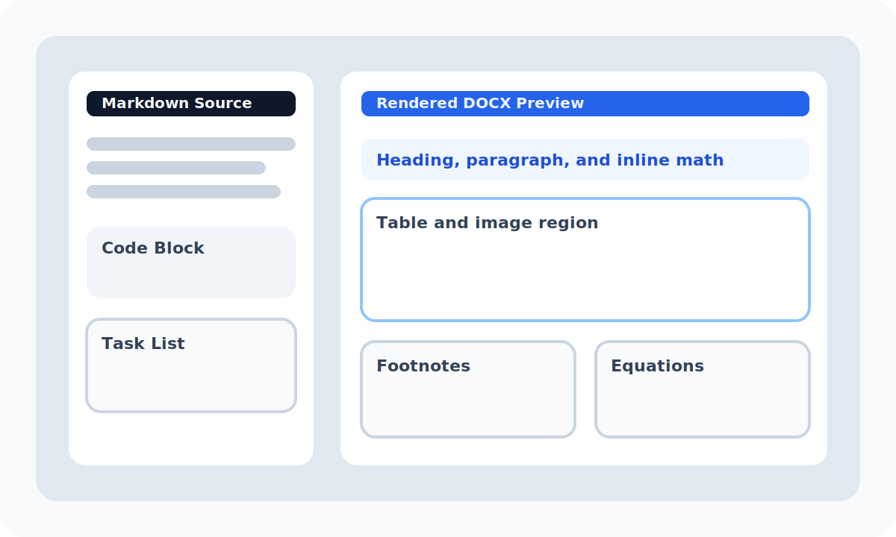

# Folio Comprehensive Regression Fixture

This fixture exercises the current Folio feature set in one document. It mixes **bold**, *italic*,
~~strikethrough~~, `inline code`, and a [hyperlink](https://example.com "Example link").
This sentence ends with a forced line break.\
The next sentence should appear on a new line inside the same paragraph.

## Headings And Paragraph Flow

### Level 3 Heading

Regular paragraphs should remain readable across longer lines of text. This block also includes
inline math such as $E = mc^2$, $p = mv$, and $\frac{1}{2}mv^2$.

#### Level 4 Heading

Folio should preserve paragraph spacing, inline styling, and Unicode text such as 中文测试, 日本語, and
symbols like <=, >=, and +/- when written directly in Markdown.

## Lists

Unordered list:

- apples
- bananas
- cherries
  - nested bullet alpha
  - nested bullet beta with `code`

Ordered list starting at 3:

3. third item
4. fourth item
5. fifth item

Task list:

- [x] parse Markdown
- [x] embed local images
- [ ] polish advanced cross-reference support

## Blockquote

> Folio should produce documents that open cleanly in Word or LibreOffice.
>
> Blockquotes should retain their own visual treatment and paragraph separation.

## Code Blocks

```rust
fn summarize(name: &str) -> String {
    format!("Hello, {name}! This fixture validates Folio.")
}
```

```json
{
  "app": "Folio",
  "mode": "comprehensive-fixture",
  "features": ["math", "tables", "images", "footnotes"]
}
```

## Table Coverage

| Feature | Alignment | Notes |
| :------ | :-------: | ----: |
| Headings | centered | H1-H6 styles |
| Inline styles | mixed | **bold**, *italic*, `code` |
| Equations | editable | $a^2 + b^2 = c^2$ |
| Images | local | PNG + SVG |

## Math Coverage

Inline formulas should remain editable: $x_n = x_{n-1} + \Delta x$ and $\sum_{i=1}^{n} i = \frac{n(n+1)}{2}$.

Display equation:

$$\int_0^1 x^2 \, dx = \frac{1}{3}$$

Quadratic formula:

$$x = \frac{-b \pm \sqrt{b^2 - 4ac}}{2a}$$

Matrix:

$$\begin{pmatrix} a & b \\ c & d \end{pmatrix}$$

## Image Coverage

Raster image test:


Wide SVG banner test:


Diagram SVG test:



## Footnotes

Folio should render native footnotes for editorial notes[^editorial] and implementation notes[^impl].

[^editorial]: This footnote checks native footnote emission and numbering.
[^impl]: This footnote confirms that longer footnote text still remains readable.

---

## Closing Notes

Use this fixture when checking output regressions in:

- paragraph styling
- list numbering
- table borders and alignment
- math fidelity
- raster and SVG image embedding
- footnote handling
